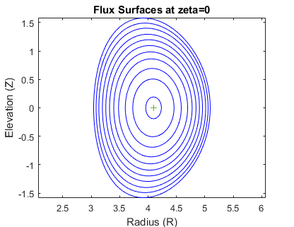
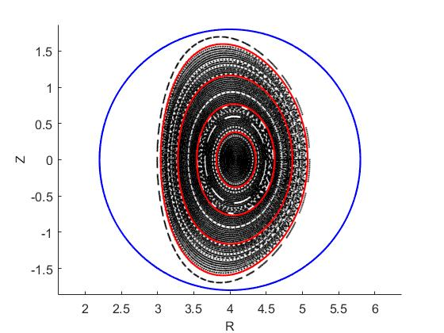
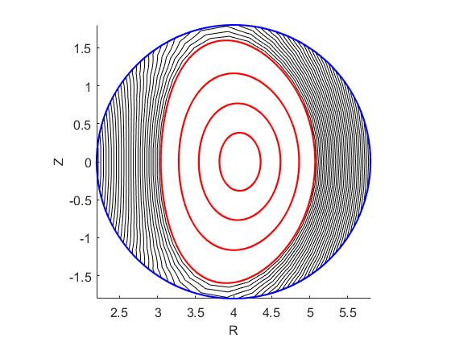
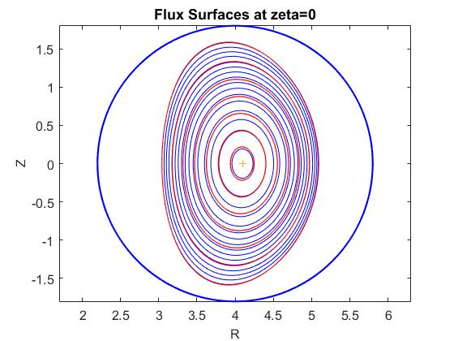

## Free-boundary SPEC benchmark in tokamak geometry
### Step 1: Generation of the coils and Vns
We made a simple VMEC equilibrium in (large aspect ratio) tokamak geometry with a D-shape boundary. Both the pressure and the rotational transform are linear functions of the toroidal flux.

After the equilibrium was generated by VMEC, the coil optimization code FOCUS was executed to generate the coils. We ran free-boundary VMEC using the mgrid file computed from the coils and verified that fix/free-boundary VMEC has exactly the same plasma boundary and flux surfaces.

Finally, we have chosen the SPEC computational boundary to be circular outside the plasma boundary. The vacuum field Fourier harmonics, _Vns_, were computed by FOCUS.

 

### Step 2: Generation of the free-boundary SPEC input
A Matlab script _generate_spec_nl_from_vmec.m_ was used to extract the flux surfaces from VMEC fixed-boundary output. The linking currents, _curtor_ and _curpol_, come from VMEC output and FOCUS. Initially we put four volumes at equal distant sqrt(psi_t) surfaces. The pressure in each surface is taken to be psi_t average. This initial input file is _solovev_fb_vmec_initial.sp_, which was created using the template of the end file of _solovev_fb.sp_ provided by @zhucaoxiang. One has to manually change _Lrad_ and _Mpol_ and provides guess for _tflux_ and _pflux_ for the vacuum region. Note that the _iota_, _oita_ and _pflux_ are negative. 

### Step 3: Free-boundary iterations
Initially, all the _Bns_ are zero. To initialize _Bns_, it is suggested that one runs virtual casing >30 times with the blending parameter 0 and _Lfindzero_=0. Alternatively, one can choose to hack the virtual casing using the field on the inner side of the plasma boundary. Then we can copy the end file as a new input and set _Lfindzero_=2. This is _solovev_fb_vmec.sp_. The initial blending parameter should be 0.8 or more, then we can reduce it gradually to zero after each 10 free boundary iterations. __We suggest to reduce _upsilon_ and _epsilon_ to 0.1 for numerical stability__. Otherwise the newton iteration will be painfully slow and often tells "bad progress".

After ~50 free-boundary iterations, we finally reach a consistent equilibrium. This is _solovev_fb_vmec_final.sp_.
We compared the final interfaces to fixed boundary VMEC equilibrium and found they are consistent. The figures below show the Poincare plot and the outflux.

 

 

We also provide a case with 7 volumes. The figure below shows the comparison with VMEC fixed boundary equilibrium (blue:VMEC, red: SPEC).
This file is _solovev_fb_vmec7vol_final.sp_.

 
